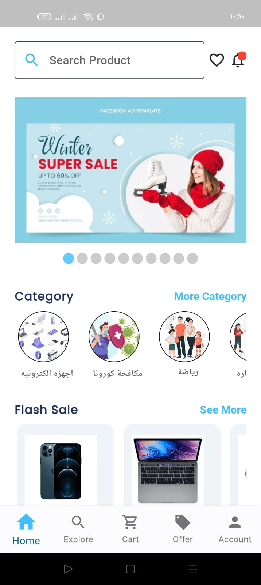
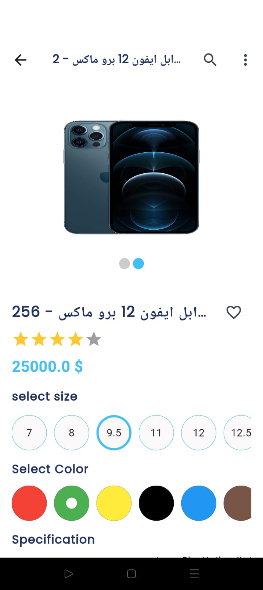
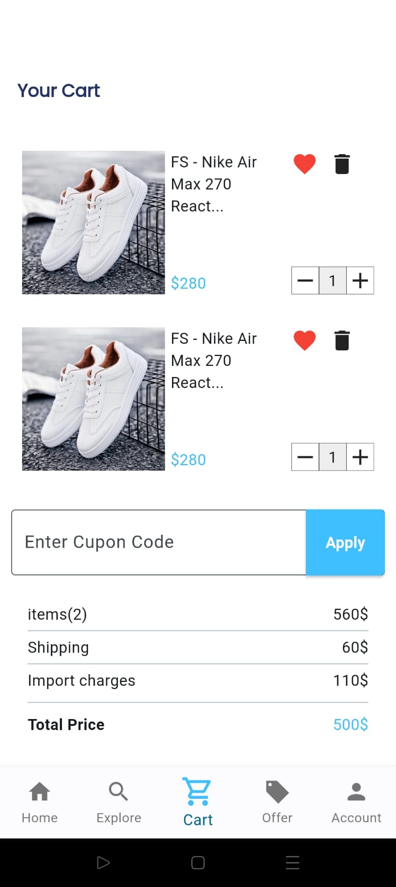

# Lafyuu Ecommerce

A comprehensive Flutter project for an ecommerce application utilizing Bloc/Cubit for efficient state management.

## Overview

This project is a demonstration of a fully-featured ecommerce application built with Flutter. It integrates various third-party packages to provide an enhanced user experience and covers several important aspects of mobile app development, including state management, persistent storage, network requests, animations, and user authentication.

## Features

- **State Management**: Implemented using Bloc/Cubit to manage app state efficiently.
- **Splash Screen**: Integrated splash screen functionality using `easy_splash_screen` for a smooth startup experience.
- **Persistent Storage**: User preferences and app settings are stored using `shared_preferences`.
- **Image Carousel**: Product images are displayed in an attractive carousel format using `carousel_slider`.
- **Network Requests**: `dio` is used for making efficient API calls and handling network requests.
- **Loading Effects**: `shimmer` is used to show placeholder loading effects while content is being fetched.
- **Animations**: `lottie` provides rich animations for an engaging user interface.
- **Authentication**: Firebase authentication is integrated for secure user login and registration, with support for Google and Facebook sign-in.
- **Custom App Icons**: Configured app icons for both Android and iOS using `flutter_launcher_icons`.

## Packages Used

- **easy_splash_screen**: ^1.0.4 - Simplifies the creation of splash screens.
- **shared_preferences**: ^2.2.2 - Provides persistent storage for simple data.
- **carousel_slider**: ^4.2.1 - Enables carousel-style image displays.
- **flutter_launcher_icons**: ^0.13.1 - Simplifies the process of updating app launcher icons.
- **dio**: ^5.3.4 - Powerful HTTP client for Dart, used for making network requests.
- **shimmer**: ^3.0.0 - Adds shimmer loading effects for a polished look.
- **lottie**: ^2.7.0 - Renders rich animations for an engaging UI.
- **flutter_bloc**: ^8.1.3 - Implements the BLoC (Business Logic Component) pattern.
- **firebase_core**: ^2.25.4 - Core Firebase SDK for initializing Firebase.
- **google_sign_in**: ^6.2.1 - Enables Google sign-in integration.
- **firebase_auth**: ^4.17.7 - Firebase Authentication SDK.
- **flutter_facebook_auth**: ^6.1.1 - Enables Facebook sign-in integration.

## Application Images

